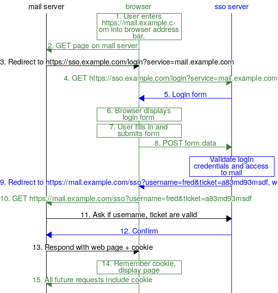

The Magic of Single Sign-On
================================

I remember being really impressed the first time I encountered single sign-on (SSO), in which I could access multiple websites after just logging in once. But I was even more impressed when I learned that underlying SSO are just a few, basic HTTP features.

Scenario
------------

Suppose I work for the big tech firm `example.com`. My web mail is at `https://mail.example.com`, my shared files are at `https://files.example.com`, my continuous integration server is at `https://ci.example.com` — you get the idea.

Once upon a time, my accounts on all those services might have been separate, each with its own password. Hopefully I could use the same username everywhere, but even that isn't a given.

More recently, I might have been able to use the same username and password on all those services, probably by them all sharing a common database of those usernames and passwords (maybe LDAP, Kerberos, or Active Directory). But I'd still have to log in to every service separately.

Today, I can probably log in just once, and then access all my services. We have achieved Single Sign-On, or SSO.

Another scenario — you go to the hottest new website, where you've never been before, and see a button labeled "Use your Facebook account." You click it, and just like that, you're logged in to the new site, *without* entering your Facebook username and password.

Does this require some fancy security services that were just added to browsers? Actually no! One of the most impressive things about how this works is that it can be implemented using some very foundational pieces of the HTTP protocol: redirects and cookies.

Redirects
----------------

When you type an address into your browser's address bar — say ``https://cnn.com/politics/`` —  your browser will try to get the web page at that address. It does that by connecting to the appropriate server over the network and requesting it. We call that a GET request.

Most of the time, the server will respond with a web page.

Occasionally, the server will instead respond with what we call a *redirect*. The server is saying that the page you want isn't at that address anymore, but you should try this other address that the response includes. It's like the post office forwarding your mail after you move, except that in this case, the letter goes back to the sender and the sender has to send another letter to the new address.

But unlike the mail forwarding, the redirect process is transparent to the user. The browser goes ahead and requests the page at the new address, and if that server responds with a web page, the browser displays it. The browser address bar will show the address of the new web page, so an observant user can tell they didn't get the address they originally requested, but the user doesn't have to take any action to make this work.

Cookies
-----------

Our browsers often look like they're holding a long back-and-forth conversation with a web server, like a phone call, but most of the time, each request and response is independent of the next, and the server has no way to know whether the request it's handling is from the same user — and the same browser — as any earlier request. It's more like sending text messages back and forth, except that on the internet, a thousand users might be using the same “phone number.”

The solution to this is an HTTP feature called *cookies*. The server can add pieces of information to any response, and the *browser* remembers the information and will add it to the next request to that same server. Each piece of information has a name and a value.

So when I ask my browser to request a page from cnn.com, and my browser doesn't include any cookies in the request, cnn.com might arbitrarily decide to call me CNN web user 237642394, and in its response, include a cookie named cnn_user with a value of 237642394. Then on my next request to cnn.com, my browser will include that cookie in the request, and cnn.com will know that it's me again.

Cookies are essential for any service that requires a user to log in. Without them, the web server would have no way to know that the request it's receiving came from the same user who provided a valid username and password in their previous request.

Sessions and Logins
--------------------------

When cookies are used to recognize that numerous web requests are coming from the same browser, we say that there is a *session* established between the browser and server.

With the server remembering a user’s session from one request to the next, now a user can log in. They go to a page and enter a valid username and password, and when those are submitted to the server and the server recognizes them as valid, the server will remember that this session is logged in, and by which user.

In order to access multiple services that require login, a user needs to have created logged-in sessions from their browser to each of those services. The essence of single sign-on is getting multiple logged-in sessions created while only requiring the user to log in — to present their username and password — once.

The SSO Server Login Session
---------------------------------------

The user still has to login once. In the process I'm describing, they'll do that on the single sign-on server. They'll enter their username, password, two factor authentication, whatever they need, on a page or pages on the SSO server. If they're all correct, then the SSO server will know from then on that this session has logged in, and which user it is.

Using Another Server
----------------------------

Now suppose the user goes to a page on their mail server, and that page requires login. The mail server sees that this session is not logged in, and so it responds with a redirect to a URL on the SSO server. Now the browser requests the new URL from the SSO server.

The browser *does* have a logged-in session with the SSO server, and so when it requests this URL, the SSO server will know that this is coming from a user who has successfully authenticated.

The SSO server could just redirect back to the mail server, including an "?ok=1" on the URL to tell the mail server that it's okay to let the user in, but that of course would be totally insecure. In no time at all, people would figure out that they could access the mail service without logging in, just by adding "?ok=1" to the URL.

But what happens is actually close to that. Suppose instead of passing "1", the SSO server passes a large random number, which we'll call a "token," and remembers what the token was. Then when the mail server sees it, the mail server can call the SSO server directly — not going through the user's browser, so the user has no chance to meddle with this communication — and ask if that token is valid. The SSO server looks it up, sees that it's the token it just gave out, and responds to the mail server with information about the user who is logged in.

Once the mail server has confirmed with the SSO server, it can mark its own session with the browser as logged in by that user, and now the user can proceed to use the mail server without ever providing their credentials to it.

Enhancements
--------------------

This is just the skeleton of an SSO process. There's room for lots of enhancements.

One obvious possibility is expiring sessions. Our servers don't have to consider a logged-in session to be logged-in forever. I use some services where the sessions seem to last about a week before I have to login to the SSO server again.

Another useful feature might be giving some users access to only a subset of the services. The SSO process identifies who the user is, but the services don't have to let every recognized user in. For example, either the SSO server or the mail server could keep track of which users have email accounts. Other users might be given access to the news server, but not the mail server.

Instead of using large random numbers for tokens, the SSO server could create a token by encrypting a timestamp and username using a key only it knows. Then when the mail server calls to validate the token, if it decrypts using the SSO server's secret key, and the timestamp and username look okay, then the SSO server knows it's valid. The advantage is that the SSO server can do this without having to remember what tokens it has given out before.

Magic
--------

To me it's almost magical how a few basic tools in the web protocols can be used to provide such a complex and useful behavior.

Appendix: Step-by-step
-------------------------------

Reading the rest of this post is optional. All the important points are covered above.

But for those who delight in the details, let's step through what might be happening when you log in to a set of sites that are using SSO. I won't claim that all SSO implementations work exactly like this, but this will illustrate the principles that many are based on.

The numbers in this diagram correspond to the numbered steps below.

    Diagram of logging in for the first service. (`full size <_images/sso_login1_inline.png>`_)

USER: I type the address of the service I want, say https://mail.example.com, into my browser and hit Enter.
BROWSER: My browser sends an HTTP GET request to mail.example.com.
MAIL SERVER: The mail server looks at the request for a cookie that would show that I already had a logged-in session with that server, but doesn't find it. So it starts the login process by responding to the request with a redirect to a URL at the single sign-on server, say https://sso.example.com/login. The location URL also identifies the service that the user is trying to access, perhaps by appending a query parameter, so that the full location URL might be ``https://sso.example.com/login?service=mail.example.com``.
BROWSER: When it sees a redirect response, my browser immediately sends a GET request to sso.example.com, requesting the URL ``https://sso.example.com/login?service=mail.example.com``.
SSO SERVER: Like the mail server, the SSO server looks in the request for a cookie that would show the user had already logged in. Not seeing one, the SSO server responds with a web page containing a login form. The form asks for a username and password, and says to submit its input back to ``https://sso.example.com/login?service=mail.example.com``.
BROWSER: receiving the web page response, the browser displays it to me, the user.
USER: I see the login form, enter a valid username and password, and click Submit.
BROWSER: The browser sees that the form data is supposed to be sent to sso.example.com, and so the browser sends a POST request to sso.example.com with the URL ``https://sso.example.com/login?service=mail.example.com`` and containing the username and password
SSO SERVER: The SSO server receives the username and password, and uses some method (not important here) to see if the username and password are valid — in other words, do they prove that someone who is supposed to be able to access this SSO service seems to be at the browser? If the credentials are valid, the SSO server responds with a redirect to another URL on the mail server (the service the user was trying to log in to), say ``https://mail.example.com/sso``, with a query parameter indicating the username. The SSO server also generates a string we'll call a *ticket* and includes that as well. We end up with ``https://mail.example.com/sso?username=fred&ticket=a83md93msdf``. The response also contains a cookie.
BROWSER: The browser first sees the cookie in the response and makes a note that it should include that cookie when it makes future requests to ``sso.example.com``. Then, since the response is a redirect, the browser sends a new GET to mail.example.com for the URL ``https://mail.example.com/sso?username=fred&ticket=a83md93msdf``.
MAIL SERVER: The mail server cannot assume from this request that the user has actually logged in successfully. After all, anyone could type a URL like that into their browser. So the mail server sends a request to the SSO server to ask whether that username and ticket are really okay to access the mail service.
SSO SERVER: The SSO server checks that it did validate that user to use the mail service and give out that ticket, and sends a positive response.
MAIL SERVER: Receiving confirmation from the SSO server that this user has properly authenticated themselves and is allowed to access the mail service, the mail server responds with a web page, but also includes a new cookie, whose value the mail server will be able to recognize again on future requests from this browser.
BROWSER: The browser first sees the cookie in the response and makes a note that it should include that cookie when it makes future requests to ``mail.example.com``.  Then it displays the web page to the user.
USER: I see the web page and start reading my mail. From here on, all my requests to ``mail.example.com`` include the cookie that lets the mail server know that I have logged in.

So far, this just seems like an incredibly convoluted way to log in to read my mail. The user doesn't see anything more complicated than a simple login, but behind the scenes, there is a lot going on.

But now let's see what happens when the user checks their calendar.

USER: I type the address of the service I want, say https://calendar.example.com, into my browser and hit Enter.
BROWSER: My browser sends an HTTP GET request to calendar.example.com.
CALENDAR SERVER: The calendar server looks at the request for a cookie that would show that I already had a logged-in session with that server, but doesn't find it. So it starts the login process by responding to the request with a redirect to a URL at the single sign-on server, say https://sso.example.com/login. The location URL also identifies the service that the user is trying to access, perhaps by appending a query parameter, so that the full location URL might be ``https://sso.example.com/login?service=calendar.example.com``.
BROWSER: When it sees a redirect response, my browser immediately sends a GET request to the location specified in the redirect. In this case, it sends a GET to sso.example.com, requesting the URL ``https://sso.example.com/login?service=calendar.example.com``.
SSO SERVER: Like the calendar server, the SSO server looks in the request for a cookie that would show the user had already logged in. This time it finds one. The cookie tells it who the user is. The server just checks that this user is allowed to use the calendar server, then bypasses the whole login process and responds with a redirect such as ``https://calendar.example.com/sso?username=fred&ticket=ooac56hrg9fguhiosd``.
BROWSER: Since the response is a redirect, the browser sends a new GET to calendar.example.com for the URL ``https://calendar.example.com/sso?username=fred&ticket=ooac56hrg9fguhiosd``.
CALENDAR SERVER: The calendar server sends a request to the SSO server to ask whether that username and ticket are really okay to access the calendar service.
SSO SERVER: The SSO server checks that it did validate that user to use the calendar service and give out that ticket, and sends a positive response.
CALENDAR SERVER: Receiving confirmation from the SSO server that this user has properly authenticated themselves and is allowed to access the calendar service, the calendar server responds with a web page, but also includes a new cookie, whose value the calendar server will be able to recognize again on future requests from this browser.
BROWSER: The browser first sees the cookie in the response and makes a note that it should include that cookie when it makes future requests to ``calendar.example.com``.  Then it displays the web page to the user.
USER: I see the web page and start looking at my calendar. From here on, all my requests to ``calendar.example.com`` include the cookie that lets the calendar server know that I have logged in.

Quite a bit still happened behind the scenes, *but* the user never saw it. From their point of view, they entered the calendar URL and immediately saw their calendar. They did not have to log in again.
